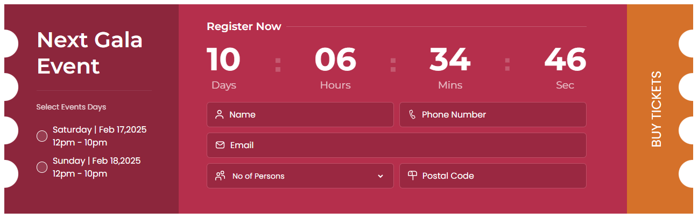

# Vendor Form and Ticket System

[Demo of Form & Ticket](https://hayyanshaikh.github.io/Ticket-UI)

### Project Description

This is a simple **Vendor Form** and **Ticket Generation System** built using **HTML** and **CSS**. Users fill out the form, and upon submission, a ticket is generated.

### Features

- Vendor form for user input
- Ticket generation upon form submission
- Clean and responsive design

### Technologies Used

- **HTML** for structure
- **CSS** for styling and layout

### Usage

1. Download or clone the project files.
2. Open `index.html` in your browser.
3. Fill out the form, and the ticket will be generated automatically.

### Screenshots

#### Vendor Form

#### Generated Ticket
